# Práctica Estados - Gonzalo Romero Bernal

---

## Índice

1.  [Creación del proyecto](#creación-del-proyecto)
2.  [Ejercicio 1 — Text](#ejercicio-1--text)
3.  [Ejercicio 2 — TextField](#ejercicio-2--textfield)
4.  [Ejercicio 3 — Button](#ejercicio-3--button)
5.  [Ejercicio 4 — Image](#ejercicio-4--image)
6.  [Ejercicio 5 — Progress](#ejercicio-5--progress)
7.  [Ejercicio 6 — Switch](#ejercicio-6--switch)
8.  [Ejercicio 7 — Checkbox](#ejercicio-7--checkbox)
9.  [Ejercicio 8 — Radiobutton](#ejercicio-8--radiobutton)
10. [Ejercicio 9 — Slider](#ejercicio-9--slider)
11. [Ejercicio 10 — Card](#ejercicio-10--card)
12. [Ejercicio 11 — Dialog](#ejercicio-11--dialog)
13. [Ejercicio 12 — Proyecto](#ejercicio-12--proyecto)

---

## Creación del proyecto

* **Nombre del proyecto:** `bloqueCompose`
* **Tipo:** `Empty Activity`
* **Lenguaje:** **Kotlin**
* **Min SDK:** API 24

---

## Ejercicio 1 — Text

**Explicación:** He investigado los distintos estilos que puede tener un componente Text, modificando grosores de fuente, estilos, colores y tamaños. También he incorporado un Divider para separar visualmente los textos y mejorar la legibilidad.

**Código:** https://github.com/gromber05/bloqueCompose/blob/b07f5bc40dac965fc4f967ced59579a5e1648c36/app/src/main/java/com/gromber05/bloquecompose/ejercicios/Ej01.kt#L22-L74

**Foto:** 
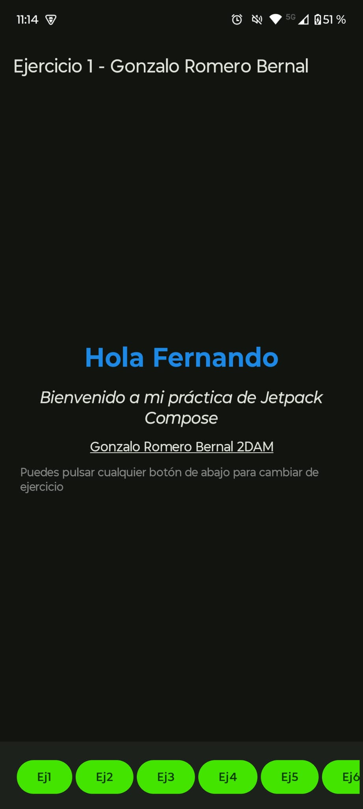

---

## Ejercicio 2 — TextField

**Explicación:** He creado dentro de una columna, tres OutlinedTextField. Estos componentes son similares a un TextField normal, pero muestran bordes definidos para delimitar visiblemente su área. Todos utilizan variables de estado para implementar que si un campo queda vacío, se muestra un mensaje de error con texto resaltado.

**Código:** https://github.com/gromber05/bloqueCompose/blob/b07f5bc40dac965fc4f967ced59579a5e1648c36/app/src/main/java/com/gromber05/bloquecompose/ejercicios/Ej02.kt#L25-L113

**Foto:**
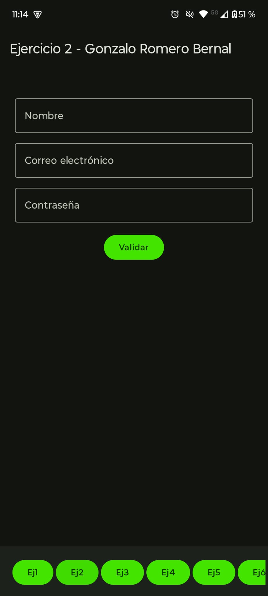

---

## Ejercicio 3 — Button

**Explicación:** He creado un contador utilizando dos botones que modifican el valor de una variable de estado (count), cuyo valor se muestra en un texto. Además, el primer botón (restar) permanece deshabilitado si el valor de count no es mayor que cero, para prevenir valores negativos.
 
**Código:**  https://github.com/gromber05/bloqueCompose/blob/b07f5bc40dac965fc4f967ced59579a5e1648c36/app/src/main/java/com/gromber05/bloquecompose/ejercicios/Ej03.kt#L22-L50

**Foto:** 
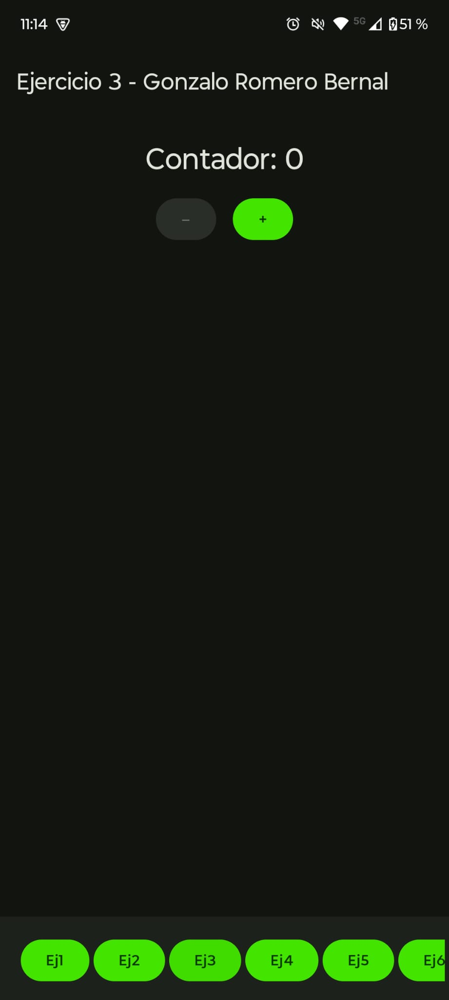

---

## Ejercicio 4 — Image

**Explicación:** He implementado una galería mostrando tres imágenes cargadas desde recursos drawable de Android, utilizando un bucle repeat para generar los elementos (basándose en un esquema de ID numérico para las imágenes). Además, incluye un botón con un icono de corazón que gestiona su propio estado, al pulsarlo, cambia su color y actualiza el texto adyacente para indicar si está en favoritos o no.

**Código:** https://github.com/gromber05/bloqueCompose/blob/b07f5bc40dac965fc4f967ced59579a5e1648c36/app/src/main/java/com/gromber05/bloquecompose/ejercicios/Ej04.kt#L36-L107

**Foto:**
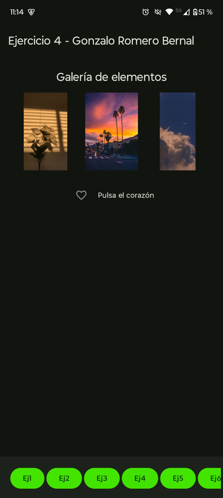

---

## Ejercicio 5 — Progress

**Explicación:** Este ejercicio simula una operación asíncrona mediante una corrutina. Al iniciar, la variable de estado isLoading se establece en true, lo cual lanza la corrutina y muestra un ProgressIndicator. El texto cambia a "Cargando...". Después de tres segundos, la corrutina finaliza, isLoading se vuelve false (ocultando el indicador) y el texto cambia a "Carga Completada".

**Código:** https://github.com/gromber05/bloqueCompose/blob/b07f5bc40dac965fc4f967ced59579a5e1648c36/app/src/main/java/com/gromber05/bloquecompose/ejercicios/Ej05.kt#L22-L61

**Foto:**
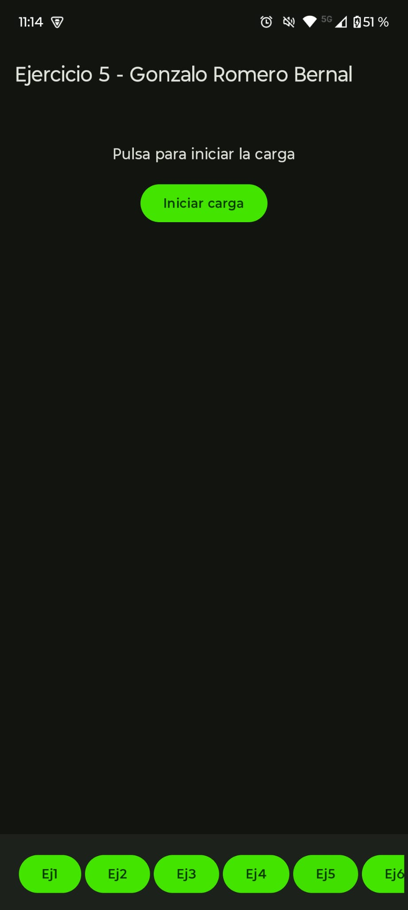

---

## Ejercicio 6 — Switch

**Explicación:** He implementado un control Switch que gestiona una variable booleana. Esta variable se utiliza para simular el cambio entre un modo claro y un modo oscuro, dependiendo de si el valor del switch es true o false.

**Código:** https://github.com/gromber05/bloqueCompose/blob/b07f5bc40dac965fc4f967ced59579a5e1648c36/app/src/main/java/com/gromber05/bloquecompose/ejercicios/Ej06.kt#L25-L63

**Foto:** 
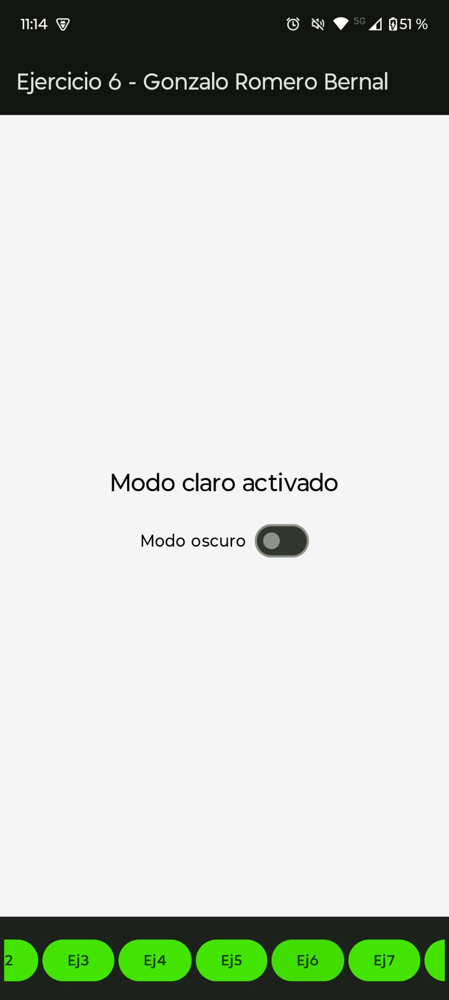

---

## Ejercicio 7 — CheckBox

**Explicación:** Este ejercicio muestra varios componentes Checkbox. La selección de cada casilla se maneja de forma individual y, al marcarse, su valor se añade a una lista de elementos, la cual se actualiza en tiempo real en un componente Text. En este ejercicio, hay distintos checkbox que cuando se marcan, añaden su valor a una lista para que luego se puedan mostrar.

**Código:** https://github.com/gromber05/bloqueCompose/blob/b07f5bc40dac965fc4f967ced59579a5e1648c36/app/src/main/java/com/gromber05/bloquecompose/ejercicios/Ej07.kt#L13-L52

**Foto:**
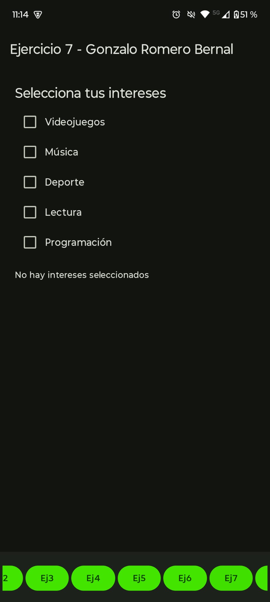

---

## Ejercicio 8 — RadioButton

**Explicación:** Este ejercicio es similar al anterior, pero implementa una lógica de selección única usando RadioButtons. La selección se gestiona a través de una única variable de estado que almacena el valor del elemento actualmente seleccionado, asegurando que solo una opción pueda estar marcada a la vez.

**Código:** https://github.com/gromber05/bloqueCompose/blob/b07f5bc40dac965fc4f967ced59579a5e1648c36/app/src/main/java/com/gromber05/bloquecompose/ejercicios/Ej08.kt#L13-L48

**Foto:** 
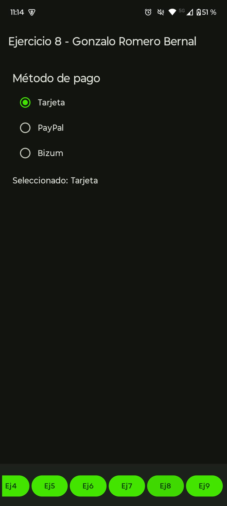

---

## Ejercicio 9 — Slider

**Explicación:** He utilizado un componente Slider para controlar el tamaño de un Icon, simulando la funcionalidad de un control de volumen. A medida que el valor del slider cambia, el tamaño del icono se actualiza dinámicamente.

**Código:** https://github.com/gromber05/bloqueCompose/blob/b07f5bc40dac965fc4f967ced59579a5e1648c36/app/src/main/java/com/gromber05/bloquecompose/ejercicios/Ej09.kt#L25-L57

**Foto:** 
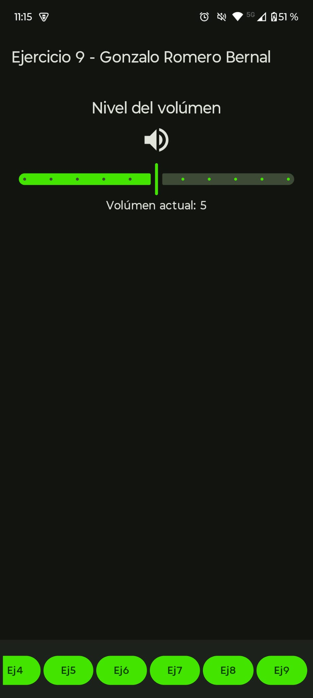

---

## Ejercicio 10 — Card

**Explicación:** He creado un componente Card que simula la tarjeta de entrenador de Ash Ketchum. Dentro de la tarjeta, se utilizan Boxes y otros componentes para mostrar información, incluyendo una imagen del personaje y las medallas de Kanto.

**Código:** https://github.com/gromber05/bloqueCompose/blob/b07f5bc40dac965fc4f967ced59579a5e1648c36/app/src/main/java/com/gromber05/bloquecompose/ejercicios/Ej10.kt#L32-L122

**Foto:**
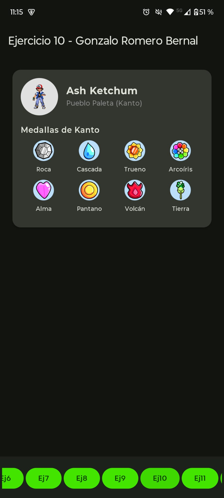

---

## Ejercicio 11 — Dialog

**Explicación:** Este ejercicio implementa un Dialog que se muestra al pulsar un botón. El diálogo contiene un título, un mensaje y dos botones, Pastilla Azul y Pastilla Roja. Al presionar el primero, la aplicación se cierra, al seleccionar el segundo, se muestra en la pantalla una foto de Morfeo, con el texto "Entraste en la matrix". Se gestiona mediante una variable de estado booleana (showDialog) que controla su visibilidad.

**Código:** https://github.com/gromber05/bloqueCompose/blob/b07f5bc40dac965fc4f967ced59579a5e1648c36/app/src/main/java/com/gromber05/bloquecompose/ejercicios/Ej11.kt#L30-L96

**Foto:** 
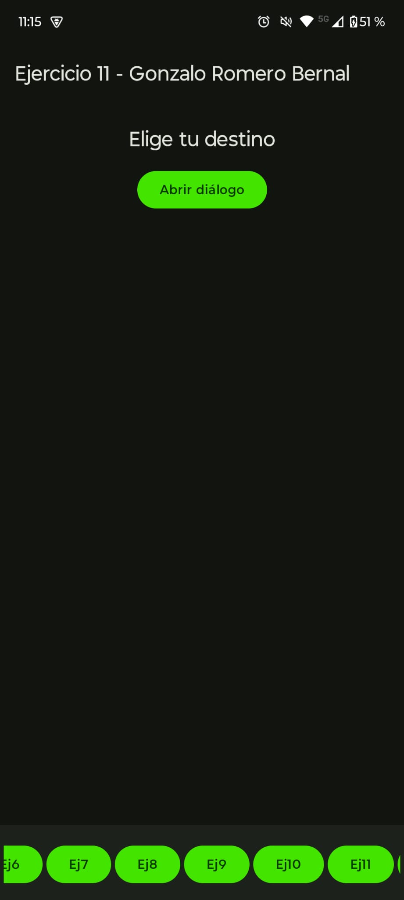

---

## Ejercicio 12 — Proyecto

**Explicación:** Este ejercicio final integra varios componentes y conceptos aprendidos (como TextField, Button, layouts y estados) para construir un proyecto más completo. El diseño organiza los elementos de la interfaz de usuario de manera estructurada para simular una aplicación funcional.

**Código:** https://github.com/gromber05/bloqueCompose/blob/79fb3073545f4d097610bc6a3e82383c64975252/app/src/main/java/com/gromber05/bloquecompose/ejercicios/Ej12.kt#L34-L321

**Foto:** 
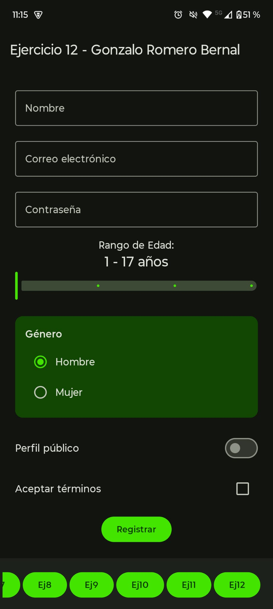

---
